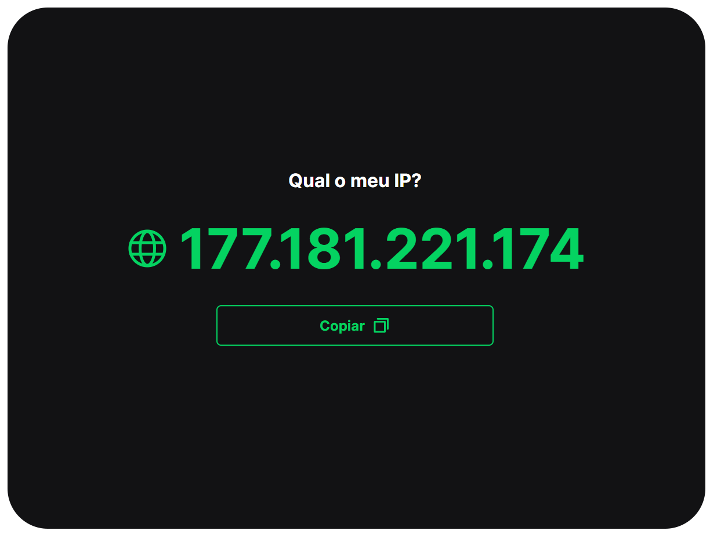

<div id="top"></div>

<!-- PROJECT LOGO -->
<br />
<div align="center">
  <a href="https://github.com/luizfranzon/IPDiscover">
    
  </a>

<h3 align="center">IP Discover</h3>

  <p align="center">
    A simple app do get your IP Address.

</div>

<!-- ABOUT THE PROJECT -->
## About the project:



### Built With

* [Vite](https://vitejs.dev/)
* [React](https://pt-br.reactjs.org/)
* [React-toastify](https://fkhadra.github.io/react-toastify)
* [styled-components](https://styled-components.com/)

<br>

<!-- GETTING STARTED -->
## Getting Started

**1- Clone this repository:**
```bash
git clone https://github.com/luizfranzon/IPDiscover && cd App
```
**2- Install dependencies:**
```bash
npm install
```
**3- Run the server:**
```bash
npm run dev
```

<p align="right">(<a href="#top">back to top</a>)</p>
